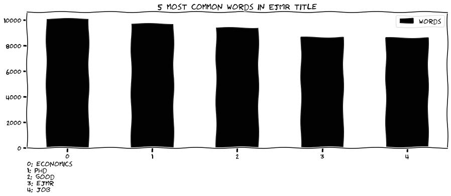
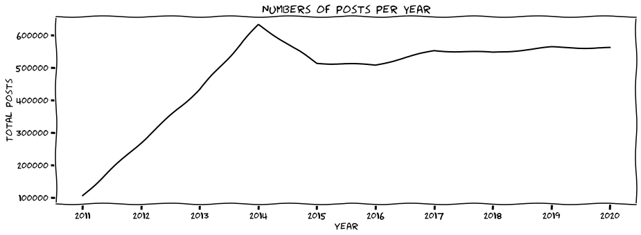

[](https://codecov.io/gh/ledwindra/ejmr-economics-job-market-rumors)


# About ✌🏽

Hello world 🌏! Are you an economist? Do you like being anonymous? Or are you fed up with such behaviors? If so, then this repository is for you!

# Warning! ⚠️
Since this repository uses cron job from GitHub Actions to update the data, consequently the .git directory will eat up disk space. Hence, it is not advisable to clone this repository to your local machine. If you are interested to do something similar, just download this repository as a zipped file. You can do the following:

```bash
# download repository from main branch
wget https://github.com/ledwindra/ejmr-economics-job-market-rumors/archive/main.zip
```

This won't include the .git directory and you can play around with the programs and data inside your local machine.

# Plot examples

From the dataset, we can generate insights by making visualizations. Following are some examples:

#### 1. Bar plot


#### 2. Density plot


#### 3. Scatter plot


#### 4. Line plot


# Download data

```
ANNOUNCEMENT!

Due to the large files that exceed the limit imposed by GitHub, both stats-table and post files are separated into multiple files so that they have smaller sizes. To get the data, just download from the data/ directory
```

I try as much to make this repository convenient for any audience, even if you haven't programmed in Python before. So just chill and relax, because you can download the data without having to run the program by yourself. Enjoy! 🌞 ⛱ 🥥 🌴 😎.

#### 1. Statistics Table 

|column_name|data_type|description|
|-|-|-|
|url|string|Thread URL|
|posts|integer|Numbers of posts|
|views|integer|Numbers of views|
|votes|string|Unclear yet|
|freshness|string|Last updated time since updated_at_utc|
|updated_at_utc|timestamp|Uploaded time in UTC|

Example (30 rows):

```
                                                  url  posts  views votes freshness              updated_at_utc
0   https://www.econjobrumors.com/topic/zac-goldsm...      1    210   0-0   4 years  2020-09-02 03:31:36.241384
1   https://www.econjobrumors.com/topic/just-talke...      1    133   0-0   4 years  2020-09-02 03:31:36.241384
2   https://www.econjobrumors.com/topic/china-tax-...      2    943   0-0   4 years  2020-09-02 03:31:36.241384
3   https://www.econjobrumors.com/topic/who-we-can...     47   2625   1-0   4 years  2020-09-02 03:31:36.241384
4   https://www.econjobrumors.com/topic/to-ken-jud...     12   1622   1-5   4 years  2020-09-02 03:31:36.241384
5   https://www.econjobrumors.com/topic/what-is-th...     40   1414   0-1   4 years  2020-09-02 03:31:36.241384
6   https://www.econjobrumors.com/topic/htc-sales-...      4    314   0-0   4 years  2020-09-02 03:31:36.241384
7   https://www.econjobrumors.com/topic/why-does-e...     16    628   0-6   4 years  2020-09-02 03:31:36.241384
8   https://www.econjobrumors.com/topic/the-solow-...      2    380   0-0   4 years  2020-09-02 03:31:36.241384
9     https://www.econjobrumors.com/topic/a-cats-meow      1    204   0-0   4 years  2020-09-02 03:31:36.241384
10  https://www.econjobrumors.com/topic/jill-watso...      1    212   0-0   4 years  2020-09-02 03:31:36.241384
11  https://www.econjobrumors.com/topic/what-is-th...      6    428   0-0   4 years  2020-09-02 03:31:36.241384
12  https://www.econjobrumors.com/topic/zaporozhia...      4    270   2-0   4 years  2020-09-02 03:31:36.241384
13  https://www.econjobrumors.com/topic/best-r-pac...     11    625   0-0   4 years  2020-09-02 03:31:36.241384
14  https://www.econjobrumors.com/topic/wasted-day...      4    328   1-0   4 years  2020-09-02 03:31:36.241384
15  https://www.econjobrumors.com/topic/how-to-str...      2    282   0-0   4 years  2020-09-02 03:31:36.241384
16  https://www.econjobrumors.com/topic/hiding-in-...      8    490   1-0   4 years  2020-09-02 03:31:36.241384
17  https://www.econjobrumors.com/topic/itt-we-pro...      2    197   0-0   4 years  2020-09-02 03:31:36.241384
18  https://www.econjobrumors.com/topic/econodork-...      3    340   2-1   4 years  2020-09-02 03:31:36.241384
19  https://www.econjobrumors.com/topic/math-grad-...     21   1570   0-2   4 years  2020-09-02 03:31:36.241384
20  https://www.econjobrumors.com/topic/captain-eu...      1    189   1-0   4 years  2020-09-02 03:31:36.241384
21  https://www.econjobrumors.com/topic/first-2-ho...      3    826   0-1   4 years  2020-09-02 03:31:36.241384
22  https://www.econjobrumors.com/topic/whos-more-...      1    167   0-1   4 years  2020-09-02 03:31:36.241384
23  https://www.econjobrumors.com/topic/i-want-my-...      2    235   0-0   4 years  2020-09-02 03:31:36.241384
24  https://www.econjobrumors.com/topic/southern-m...     22   3029   1-1   4 years  2020-09-02 03:31:36.241384
25  https://www.econjobrumors.com/topic/top-10-dep...     15    847   0-0   4 years  2020-09-02 03:31:36.241384
26  https://www.econjobrumors.com/topic/why-do-whe...      1    379   0-0   4 years  2020-09-02 03:31:36.241384
27  https://www.econjobrumors.com/topic/best-histo...     17    957   0-0   4 years  2020-09-02 03:31:36.241384
28  https://www.econjobrumors.com/topic/autism-rat...     10    362   1-1   4 years  2020-09-02 03:31:36.241384
29  https://www.econjobrumors.com/topic/probabilit...      7    800   1-0   4 years  2020-09-02 03:31:36.241384
```

#### 2. Post

|column_name|data_type|description|
|-|-|-|
|url|string|Thread URL|
|post|string|Post for each thread (one thread can contain more than one posts)|
|posted_at|string|Last posted time since update_at_utc|
|good|integer|Numbers of EJMR users who vote the corresponding post as good|
|no_good|integer|Numbers of EJMR users who vote the corresponding post as no good|
|updated_at_utc|timestamp|Uploaded time in UTC|

Example (30 rows):

```
                                                  url                                               post     posted_at  good  no_good              updated_at_utc
0   https://www.econjobrumors.com/topic/reminder-r...  Why? Because people were promoted based on mer...  6 years ago      7        1  2020-09-02 03:36:14.587802
1   https://www.econjobrumors.com/topic/reminder-r...  \nWestern science went nowhere for the last fi...  6 years ago      0        0  2020-09-02 03:36:14.587825
2   https://www.econjobrumors.com/topic/reminder-r...  Why? Because people were promoted based on mer...  6 years ago      2        0  2020-09-02 03:36:14.587837
3   https://www.econjobrumors.com/topic/reminder-r...  Launches for 2012(failures)\nRussia           ...  6 years ago      1        1  2020-09-02 03:36:14.587853
4   https://www.econjobrumors.com/topic/reminder-r...  China strong, Uurope good, Russia and US risky.\n  6 years ago      3        0  2020-09-02 03:36:14.587871
5   https://www.econjobrumors.com/topic/reminder-r...  Wernher Magnus Maximilian von Braun doesn't so...  6 years ago      3        0  2020-09-02 03:36:14.587883
6   https://www.econjobrumors.com/topic/reminder-r...  Why? Because people were promoted based on mer...  6 years ago      1        1  2020-09-02 03:36:14.587895
7   https://www.econjobrumors.com/topic/reminder-r...  Why? Because people were promoted based on mer...  6 years ago      3        0  2020-09-02 03:36:14.587907
8   https://www.econjobrumors.com/topic/my-webpage...  Math camp notes + problem sets with solutions....  7 years ago      1        0  2020-09-02 03:36:14.823510
9   https://www.econjobrumors.com/topic/my-webpage...             link! I could use some of that stuff\n  7 years ago      0        0  2020-09-02 03:36:14.823542
10  https://www.econjobrumors.com/topic/my-webpage...  link! I could use some of that stuff\nUntil yo...  7 years ago      1        0  2020-09-02 03:36:14.823551
11  https://www.econjobrumors.com/topic/whitepaper...  https://steemit.com/whitepaper/@roosterred/whi...  2 years ago      0        1  2020-09-02 03:36:15.047764
12  https://www.econjobrumors.com/topic/whitepaper...  The incentives of this system are a distractio...  2 years ago      0        0  2020-09-02 03:36:15.047779
13  https://www.econjobrumors.com/topic/who-is-cur...             Who? and why?  deadwood not included\n  5 years ago      0        3  2020-09-02 03:36:16.041955
14  https://www.econjobrumors.com/topic/who-is-cur...                                  Pablo Ottonello\n  5 years ago      1        1  2020-09-02 03:36:16.041955
15  https://www.econjobrumors.com/topic/who-is-cur...  It is me! Please someone say my name. :|\n--\n...  5 years ago      6        3  2020-09-02 03:36:16.041955
16  https://www.econjobrumors.com/topic/who-is-cur...                                        Karl Marx\n  5 years ago      1        1  2020-09-02 03:36:16.041955
17  https://www.econjobrumors.com/topic/who-is-cur...                                     Brunnermeier\n  5 years ago      2        5  2020-09-02 03:36:16.041955
18  https://www.econjobrumors.com/topic/who-is-cur...                               Also Hyun Son Shin\n  5 years ago      1        3  2020-09-02 03:36:16.041955
19  https://www.econjobrumors.com/topic/who-is-cur...                   DA is the most macro economist\n  5 years ago      4        0  2020-09-02 03:36:16.041955
20  https://www.econjobrumors.com/topic/who-is-cur...                                     MacroFinance\n  5 years ago      3        1  2020-09-02 03:36:16.041955
21  https://www.econjobrumors.com/topic/who-is-cur...               He said no deadwood \nMacroFinance\n  5 years ago      7        0  2020-09-02 03:36:16.041955
22  https://www.econjobrumors.com/topic/who-is-cur...  OP, it would be more effective if you made thi...  5 years ago      2        1  2020-09-02 03:36:16.041955
23  https://www.econjobrumors.com/topic/who-is-cur...                        Woodford\nAlways Woodford\n  5 years ago      0        3  2020-09-02 03:36:16.041955
24  https://www.econjobrumors.com/topic/who-is-cur...  Macro growth: DA, Galor\nMacro monetary: Woodf...  5 years ago      2        4  2020-09-02 03:36:16.041955
25  https://www.econjobrumors.com/topic/who-is-cur...                                       Eggertsson\n  5 years ago      0        1  2020-09-02 03:36:16.041955
26  https://www.econjobrumors.com/topic/who-is-cur...                        im missing the why's here\n  5 years ago      0        0  2020-09-02 03:36:16.041955
27  https://www.econjobrumors.com/topic/who-is-cur...                           Klaus Adam of Mannheim\n  5 years ago      0        1  2020-09-02 03:36:16.041955
28  https://www.econjobrumors.com/topic/who-is-cur...                        Chinn\nIto\nFrankel\nRose\n  5 years ago      0        2  2020-09-02 03:36:16.041955
29  https://www.econjobrumors.com/topic/who-is-cur...       Macro public finance golosov farhi werning\n  5 years ago      0        1  2020-09-02 03:36:16.041955
```

# Permission

Check its [<strong>`robots.txt`</strong>](https://www.econjobrumors.com/robots.txt) and it says the following:

```
ECONOMICS JOB MARKET RUMORS » PAGE NOT FOUND!
Page not found!
I'm sorry, but there is nothing at this URL.
```

It seems they are totally okay being scraped! 🤣


# Closing

If you have read up to this line, thank you for bearing with me. Hope this is useful for your purpose! 😎 🍻
